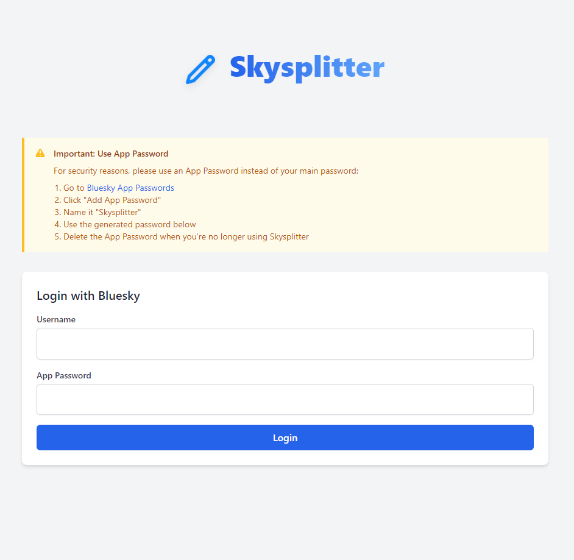

# Skysplitter Desktop

Skysplitter is a desktop application that helps you split long texts into multiple posts for the Bluesky social network. It automatically handles thread creation and maintains continuity between posts.

<div align="center">
  
  <p><em>Secure login interface with App Password support</em></p>
  
  
  <p><em>Main text input interface with user profile</em></p>
  
  
  <p><em>Preview of text splitting with automatic thread numbering</em></p>
  
  
  <p><em>Final thread preview with posting option</em></p>
</div>

## Features

- Split long text into multiple posts automatically
- Maintain thread continuity
- Automatic post numbering (e.g., 1/5, 2/5, etc.)
- Dedicated link field for clean URL sharing
- Link preview cards with metadata
- Dark mode support
- Portable application - no installation required
- Improved UI with clearer user identification

## Quick Start

### Option 1: Using Pre-built Executable
1. Download `Skysplitter-1.0.3.exe` from the `releases` folder
2. Double-click to run the application
3. No installation needed!

### Option 2: Building from Source

#### Prerequisites
- Node.js (version 14 or higher)
- npm (usually comes with Node.js)
- Git (optional, for cloning)

#### Build Steps
1. Clone or download this repository
2. Open a terminal in the project directory
3. Install dependencies:
   ```bash
   npm install
   ```
4. Build the application:
   ```bash
   npm run build
   ```
5. Find the executable in the `dist` folder

## Usage

1. Launch Skysplitter
2. Login with your Bluesky credentials
   - For security, use an App Password instead of your main password
   - Generate an App Password at [Bluesky App Passwords](https://bsky.app/settings/app-passwords)
3. Enter or paste your long text
4. (Optional) Add a URL in the dedicated link field
5. Click "Split" to preview how the text will be divided
6. Click "Post Thread" to publish your posts

## Security Note

Never use your main Bluesky password! Always use an App Password:
1. Go to [Bluesky App Passwords](https://bsky.app/settings/app-passwords)
2. Create a new App Password
3. Use that password to log in to Skysplitter
4. Delete the App Password when you're done using Skysplitter

## Development

The application is built using:
- Electron
- @atproto/api for Bluesky integration
- TailwindCSS for styling

Project structure:
```
skysplitter-desktop/
├── assets/
│   └── bluesky.ico
├── src/
│   ├── api/
│   │   └── bluesky.js
│   └── client/
│       ├── app.js
│       ├── index.html
│       └── styles.css
├── main.js
└── package.json
```

## License

MIT License - see [LICENSE](LICENSE) file for details.

## Version History

Current version: 1.0.3

### Changelog

- **v1.0.3**
  - **New Features**: Dedicated link field for simplified link handling
  - **UI Changes**: Removed automatic link detection, added manual link input
  - **UX Improvements**: Links are now always added to final post in thread
  - **Bug Fixes**: Resolved issues with link parsing and formatting
  - **Performance**: Optimized link handling and preview generation

- **v1.0.2**
  - **New Features**: Real-time text processing, link embedding previews
  - **UI Updates**: New app icon, improved user identification, fixed overlapping header
  - **Security Enhancements**: Improved session management with temporary credential storage
  - **Bug Fixes & Performance**: Minor fixes and optimizations

- **v1.0.1** - Minor updates and improvements
- **v1.0.0** - Initial release

## Author

Christian Gillinger

## Contributing

Contributions are welcome! Please feel free to submit a Pull Request.